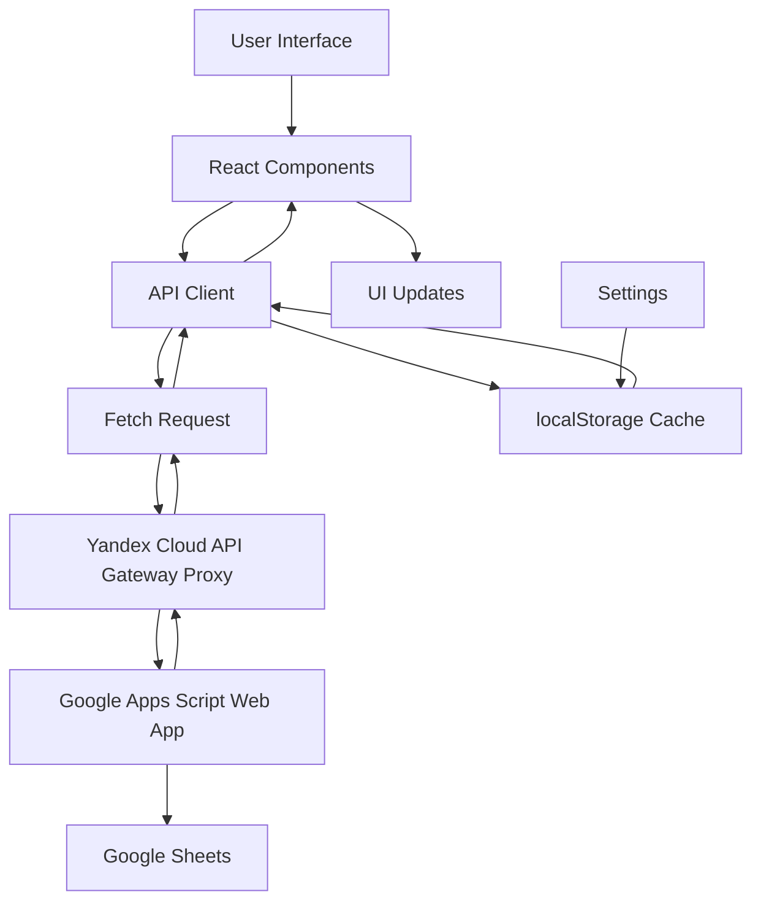

# Lespal

A super-simple React application for tracking guitar lessons and songs. Organize your learning journey with an intuitive interface that lets you record lesson notes, manage your song repertoire, and keep all your resources (tabs, videos, recordings) in one place.

## Overview

Lespal helps guitarists track their learning progress by providing two main views:
- **Lessons Tab**: Record lesson dates, notes, songs rehearsed, and remaining lesson counts
- **Songs Tab**: Manage your song library with status tracking, links to resources, and album artwork

The application uses a Google Apps Script Web App as its backend, storing data in Google Sheets while providing a modern, responsive frontend experience.

## Technology Stack

- **React 19** - Modern React with hooks
- **Vite 7** - Fast build tool and development server
- **TailwindCSS** - Utility-first CSS framework
- **shadcn/ui** - High-quality React component library built on Radix UI
- **Radix UI** - Unstyled, accessible UI primitives (Dialog, Tabs, Tooltip)
- **Node.js 22+** - Required runtime version

## Features

### Lessons Management
- Record lesson dates with formatted display
- Add multi-line notes for each lesson
- Track songs rehearsed during lessons (linked to Songs database)
- Record remaining lesson count
- Store lesson links and audio URLs
- Edit existing lessons inline

### Songs Management
- Organize songs by title and artist
- Track song status: `rehearsing`, `want`, `studied`, `recorded`
- Store links to tabs, videos, and recordings
- Auto-fetch album artwork from Apple Music API
- Manual artwork URL override
- Add notes for each song
- Automatic deduplication of songs with same title+artist
- Quick search functionality
- Songs grouped by status for easy browsing

### Settings & Configuration
- Configure backend proxy URL (Yandex Cloud API Gateway)
- Set API token for authentication
- Connection testing utility
- Settings persisted in localStorage
- **Note**: The app communicates with Google Apps Script backend through a Yandex Cloud proxy server to handle CORS and routing

### Additional Features
- **Local Caching**: 2-minute cache with localStorage persistence for faster load times
- **Offline Support**: Cached data available when backend is unavailable
- **Responsive Design**: Works on desktop and mobile devices
- **Dark Theme**: Modern dark UI optimized for extended use
- **Auto-refresh**: Manual refresh button to force data reload

## Project Structure

```
lespal/
├── src/
│   ├── App.jsx              # Main application component with all features
│   ├── main.jsx             # React entry point
│   ├── index.css            # Global styles and Tailwind imports
│   ├── components/
│   │   └── ui/              # shadcn/ui component library
│   │       ├── button.jsx
│   │       ├── card.jsx
│   │       ├── dialog.jsx
│   │       ├── input.jsx
│   │       ├── textarea.jsx
│   │       ├── badge.jsx
│   │       ├── tabs.jsx
│   │       ├── tooltip.jsx
│   │       ├── separator.jsx
│   │       └── utils.js
│   └── lib/
│       └── utils.js         # Utility functions (cn, etc.)
├── public/                  # Static assets (logos, favicon)
├── index.html               # HTML entry point
├── vite.config.js           # Vite configuration
├── tailwind.config.js       # TailwindCSS configuration
├── components.json          # shadcn/ui configuration
└── package.json             # Dependencies and scripts
```

## Setup & Installation

### Prerequisites

- Node.js 22.0.0 or higher
- npm (comes with Node.js)

### Installation Steps

1. **Clone the repository** (if applicable) or navigate to the project directory

2. **Install dependencies**:
   ```bash
   npm install
   ```

3. **Start the development server**:
   ```bash
   npm run dev
   ```
   The application will be available at `http://localhost:5173` (or the port shown in terminal)

4. **Build for production**:
   ```bash
   npm run build
   ```
   Outputs to the `dist/` directory

5. **Preview production build**:
   ```bash
   npm run preview
   ```

6. **Deploy to GitHub Pages**:
   ```bash
   npm run deploy
   ```
   This builds the project and deploys to the `gh-pages` branch

## Configuration

### First-Time Setup

1. **Configure Backend Settings**:
   - Click the Settings icon (gear) in the header
   - Enter the Yandex Cloud API Gateway proxy URL (this proxy routes requests to the Google Apps Script backend)
   - Enter your API token
   - Click "Test connection" to verify settings
   - Click "Save" to persist settings

   **Important**: The application uses a Yandex Cloud API Gateway as a proxy server between the frontend and the Google Apps Script backend. This proxy handles CORS restrictions and routing. Configure the proxy URL (not the direct Google Apps Script URL) in the settings.

2. **Settings Storage**:
   - Settings are stored in browser localStorage
   - Key: `lespal_settings_v1`
   - Format: `{ baseUrl: string, token: string }`

### Backend Architecture

Lespal uses a three-tier architecture:

1. **Frontend** (React app) → 
2. **Yandex Cloud API Gateway** (proxy server) → 
3. **Google Apps Script Web App** (backend/Google Sheets)

The Yandex Cloud proxy server handles:
- CORS restrictions (allowing browser requests to succeed)
- Request routing to the Google Apps Script backend
- Authentication token validation

### Backend Requirements

The Google Apps Script Web App backend must implement the following endpoints:

- **Endpoints**:
  - `GET /songs?action=listSongs&token={token}`
  - `GET /lessons?action=listLessons&token={token}`
  - `POST /songs?action=createSong&token={token}`
  - `POST /songs?action=updateSong&token={token}`
  - `POST /lessons?action=createLesson&token={token}`
  - `POST /lessons?action=updateLesson&token={token}`

- **Authentication**: Bearer token passed via query parameter
- **Response Format**: JSON objects with `songs` or `lessons` arrays
- **Error Handling**: JSON responses with `error` field on failure

**Note**: The Yandex Cloud proxy handles CORS, so the app can use standard fetch requests instead of JSONP when using the proxy.

## Data Models

### Lesson

```javascript
{
  id: number | string,
  date: string | Date,              // ISO date string or serial date
  notes: string,                    // Multi-line text
  topics: string,                   // Comma-separated song IDs (e.g., "12,7,25")
  link: string,                     // Optional lesson link URL
  audio_url: string,                // Optional audio recording URL
  remaining_lessons: string,        // Optional remaining lessons count
  created_at: string,               // ISO timestamp
  updated_at: string                // ISO timestamp
}
```

**Field Mapping Notes**:
- `topics` field stores comma-separated song IDs instead of topic names
- This allows linking lessons to specific songs without requiring a third database table
- The app parses this field to display song titles and allows selection in the lesson editor

### Song

```javascript
{
  id: number | string,
  title: string,
  artist: string,
  status: string,                   // "rehearsing" | "want" | "studied" | "recorded"
  tabs_link: string,                // Optional tabs/chords URL
  video_link: string,               // Optional video tutorial URL
  recording_link: string,           // Optional user recording URL
  artwork_url: string,              // Optional album artwork URL
  notes: string,                    // Optional notes about the song
  created_at: string,               // ISO timestamp
  updated_at: string                // ISO timestamp
}
```

**Song Aggregation**:
- Songs with identical title+artist are automatically aggregated
- Multiple statuses can be assigned to the same song
- The most complete record (with artwork, links, etc.) is used as the canonical version

## Architecture & Data Flow



### Key Architecture Decisions

1. **Frontend-Only Application**: All business logic is in React components; no separate backend API
2. **Proxy Architecture**: Uses Yandex Cloud API Gateway as a proxy between frontend and Google Apps Script backend
   - Handles CORS restrictions automatically
   - Routes requests to the Google Apps Script Web App
   - Enables standard fetch requests (no JSONP needed when using proxy)
3. **External Backend**: Uses Google Apps Script as a serverless backend for data persistence (Google Sheets)
4. **Local Caching**: Implements 2-minute cache with localStorage to reduce API calls
5. **Optimistic Updates**: Refreshes data after mutations to ensure consistency

### Caching Strategy

- **Cache Key**: `lespal_cache_v1`
- **Stale Time**: 2 minutes
- **Cache Structure**: 
  ```javascript
  {
    songs: Array<Song>,
    lessons: Array<Lesson>,
    tsSongs: number,      // Timestamp of last songs fetch
    tsLessons: number     // Timestamp of last lessons fetch
  }
  ```
- **Cache Invalidation**: Manual refresh button or automatic after 2 minutes

## Development

### Path Aliases

The project uses path aliases configured in `vite.config.js`:
- `@/` maps to `src/`
- Example: `import { Button } from "@/components/ui/button"`

### Styling

- **TailwindCSS**: Utility-first CSS with custom configuration
- **CSS Variables**: Theme colors defined in `src/index.css`
- **Dark Mode**: Only dark theme is implemented (class-based)

### Code Organization

- **Single File Component**: Main app logic is in `App.jsx` (~875 lines)
  - This includes all components, API client, and business logic
  - Components are defined as functions within the file
- **UI Components**: Reusable shadcn/ui components in `src/components/ui/`
- **Utilities**: Helper functions in `src/lib/utils.js`

### Self-Tests

The application includes lightweight self-tests in `App.jsx`:
- Date formatting tests
- Song aggregation tests
- Runs once on page load (non-blocking)

## API Integration Details

### Request Format

The `{baseUrl}` in requests refers to the Yandex Cloud API Gateway proxy URL configured in Settings.

**GET Requests**:
```
GET {proxyUrl}/songs?action=listSongs&token={token}
GET {proxyUrl}/lessons?action=listLessons&token={token}
```

The proxy forwards these requests to the Google Apps Script backend.

**POST Requests**:
```javascript
POST {proxyUrl}/songs?action=createSong&token={token}
Content-Type: application/json

{
  "payload": {
    "title": "Song Title",
    "artist": "Artist Name",
    // ... other fields
  }
}
```

### Error Handling

- Network errors are caught and displayed to the user
- Connection timeout handling
- Special handling for browser extension blocks (common on GitHub Pages)
- Test connection utility available in Settings to verify proxy connectivity

## Troubleshooting

### Common Issues

1. **"Request was blocked by browser extension"**
   - Disable ad blockers (uBlock, AdGuard, etc.) for the site
   - Add allow rules for `script.googleusercontent.com` and `script.google.com`
   - Try incognito/private browsing mode

2. **Settings not persisting**
   - Check browser localStorage is enabled
   - Clear cache and reconfigure settings

3. **Data not loading**
   - Verify backend URL and token in Settings
   - Use "Test connection" to verify connectivity
   - Check browser console for detailed error messages

4. **Artwork not fetching**
   - Apple Music API requires exact title/artist match
   - Manually enter artwork URL if auto-fetch fails

## Scripts Reference

```bash
npm run dev        # Start development server
npm run build      # Build for production
npm run preview    # Preview production build
npm run lint       # Run ESLint
npm run deploy     # Build and deploy to GitHub Pages
npm run predeploy  # Build and prepare 404.html for SPA routing
```

## License

This project is private and not intended for distribution.

## Contributing

This is a personal project. For questions or suggestions, please contact the repository owner.
